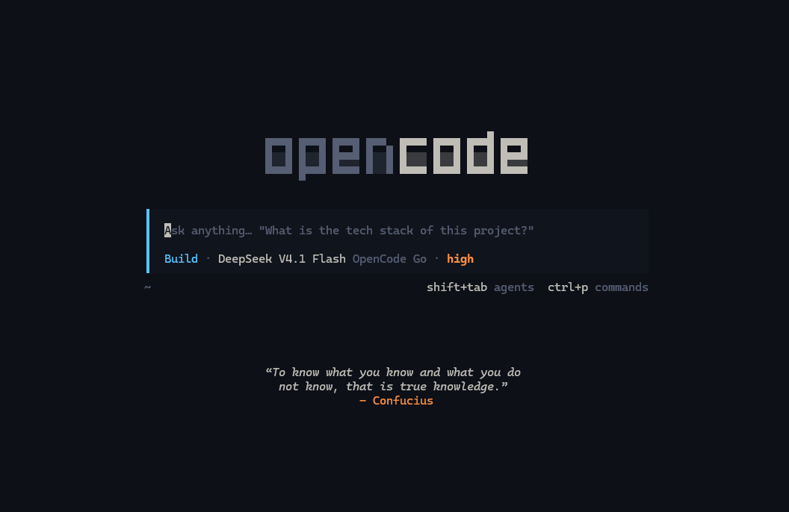
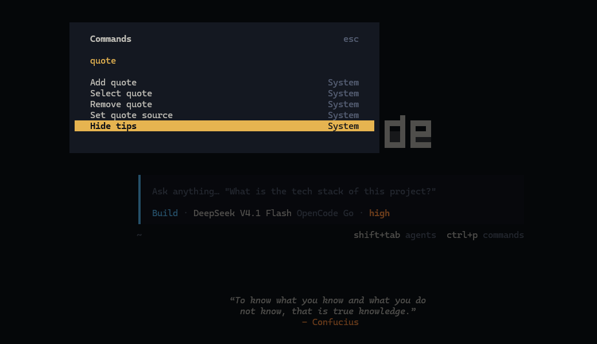

<p align="center">
  
</p>

<h1 align="center">opencode-quotes-plugin</h1>

<p align="center"><em>Motivational quotes for your OpenCode home screen.</em></p>

<p align="center">
  
  
  
</p>

Land on the OpenCode home screen and a quote is already waiting: one quiet,
centered line below the prompt instead of the usual rotating tips. Keep the
built-in collection, or curate your own.

> A V2 re-implementation of
> [aerovato/opencode-quotes-plugin](https://github.com/aerovato/opencode-quotes-plugin).
> Same quotes, same idea, rebuilt for OpenCode 2.x.

## What you get

- **A quote on the home screen** - centered below the prompt, word-wrapped, and picked at random from the active source.
- **100+ built-in quotes** from historical figures and thinkers.
- **Your own quotes** - add and remove them from the command palette.
- **Three sources** - show `built-in`, `custom`, or `both`.
- **Pin one** - keep a specific quote for the session instead of a random pick.
- **Toggle it off** - hide quotes without uninstalling anything.
- **Persistent** - quotes and settings survive restarts and stay in sync.

## Preview

<p align="center">
  
</p>

## Install

Add the package to the global CLI config at `~/.config/opencode/cli.json`:

```jsonc
{
  "plugins": ["opencode-quotes-plugin"]
}
```

Working on the plugin itself? Point OpenCode at the checkout instead:

```jsonc
{
  "plugins": ["file:///C:/path/to/opencode-quotes-plugin"]
}
```

Restart OpenCode and check that it loaded:

```sh
opencode plugin list
```

## Commands

Open the palette on the home screen (`ctrl+p`) and pick a command:

| Command                       | Does                                     |
| ----------------------------- | ---------------------------------------- |
| **Hide tips** / **Show tips** | Toggle quote visibility                  |
| **Set quote source**          | Switch between Built-in, Custom, or Both |
| **Add quote**                 | Save a quote as `"The quote" - Author`   |
| **Remove quote**              | Delete one of your saved quotes          |
| **Select quote**              | Pin a quote instead of a random one      |

## Quote sources

| Source     | Shows                         |
| ---------- | ----------------------------- |
| `built-in` | The bundled collection only   |
| `custom`   | Only the quotes you added     |
| `both`     | Both, de-duplicated (default) |

## Where your quotes live

Custom quotes, the active source, and visibility are kept in OpenCode's plugin
storage, so they survive restarts and sync across TUI instances.

## How it works

`tui.tsx` default-exports the V2 plugin definition:

```ts
import { Plugin } from "@opencode/plugin/tui";

export default Plugin.define({ id: "opencode-quotes-plugin", setup(ctx) { /* ... */ } });
```

On the home route the quote is drawn as a centered overlay and the stock footer
tips are suppressed, since the V2 home footer is pinned to the bottom of the
screen.

## Development

```sh
bun install
bun test        # unit tests for the pure helpers
bun run typecheck
```

## Credits

Built on the work of [aerovato](https://github.com/aerovato):

- Original plugin: [aerovato/opencode-quotes-plugin](https://github.com/aerovato/opencode-quotes-plugin)
- The quote collection and command design come from that project.

This repository rebuilds it for OpenCode 2.x and keeps the same quote corpus.
